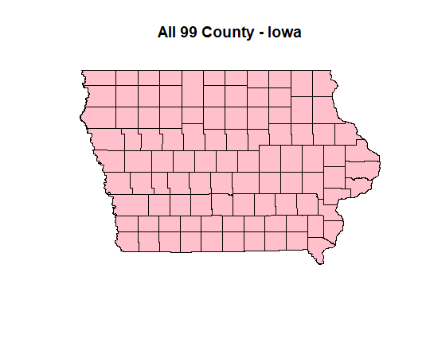
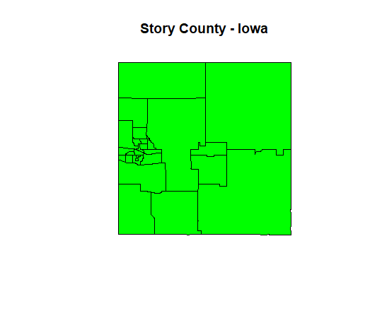
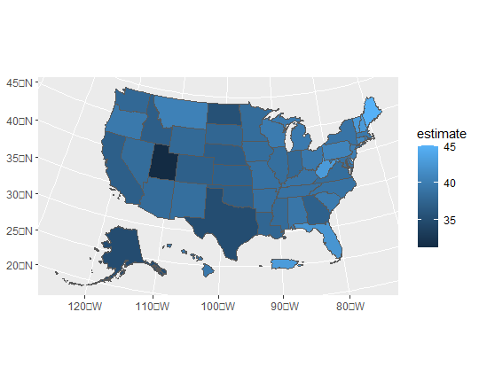
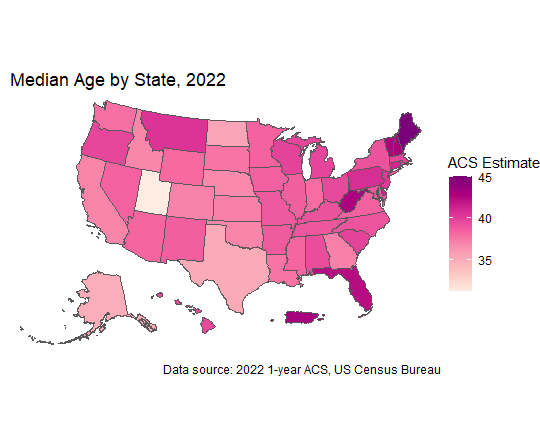
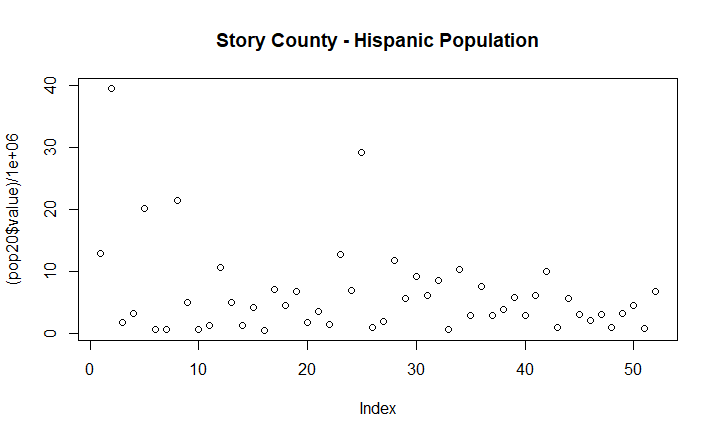
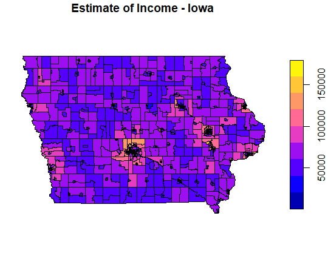
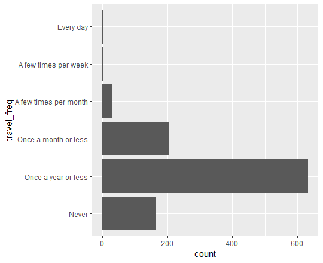
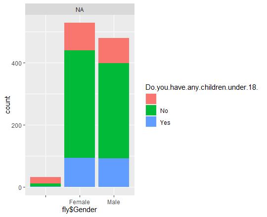
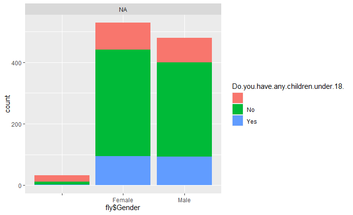

# Assignment 3

## Map 1: Some maps from Iowa 

#### I read states data and then chose Iowa and showed Iowa's counties geometry. 

#### In this map I plotted just one county of Iowa, Des Moines County.

#### In this map I plotted anothere county of Iowa that ISU campus is in it.

### Map 1: My second try: Median Age by State in the USA

### Map 1: My third try: Story County - Hispanic Population")

## Map 2: Estimate of Income - Iowa

## Map 3: Shows gender of people in fly and if they have a child with them or not.

#### Map after Professor Seeger's Comment:

