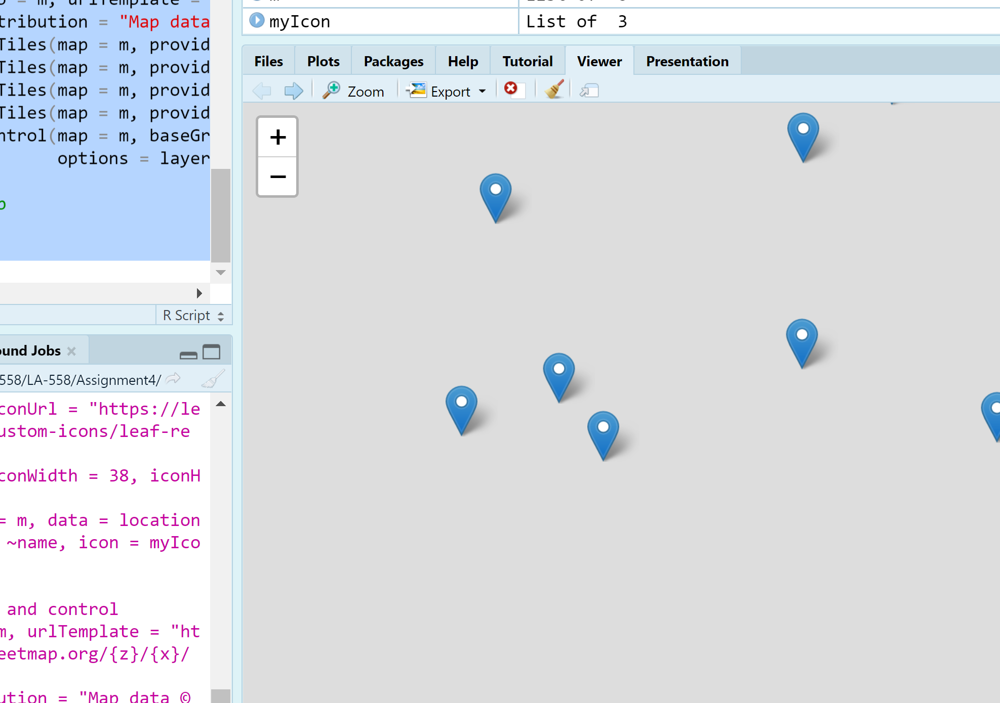
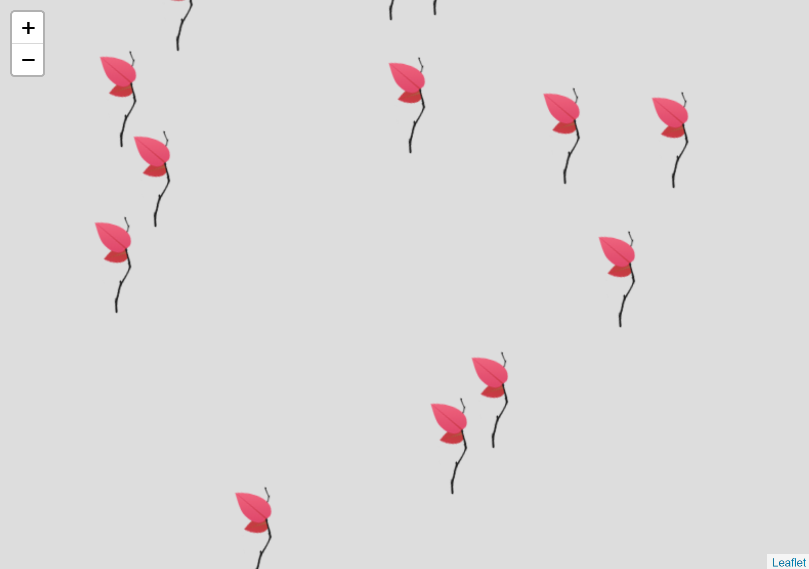
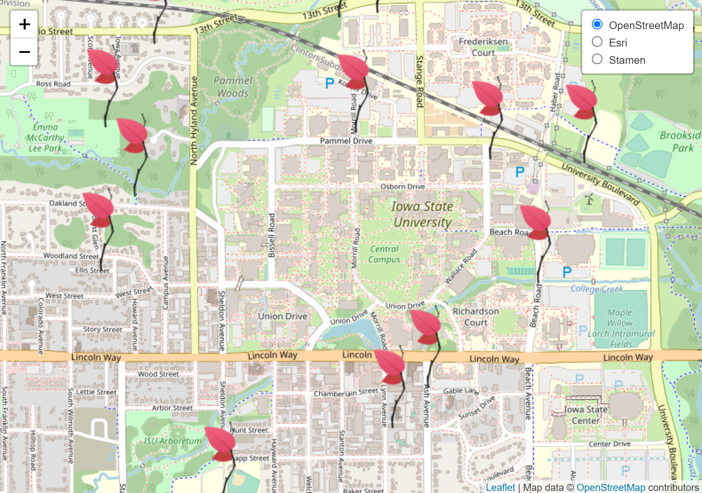
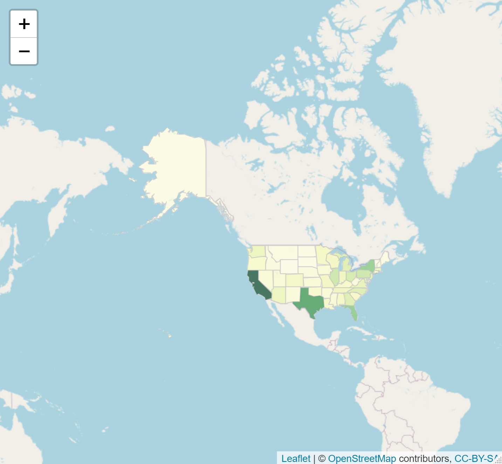
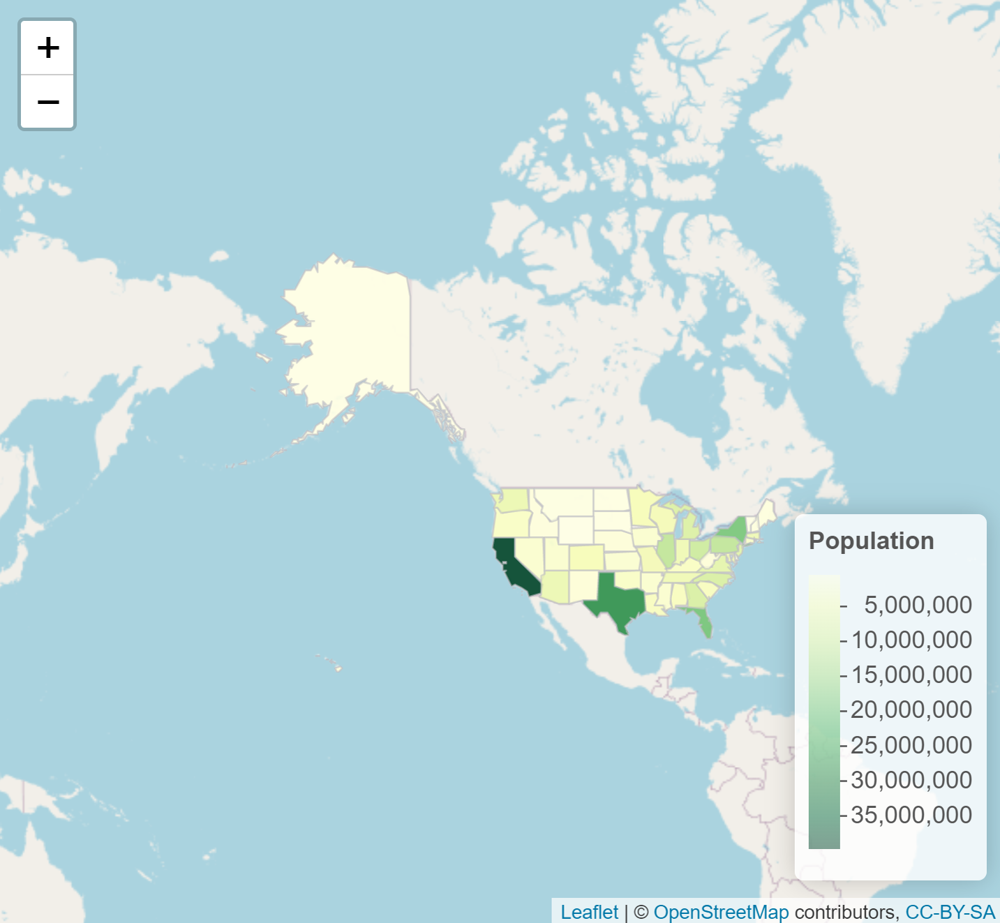
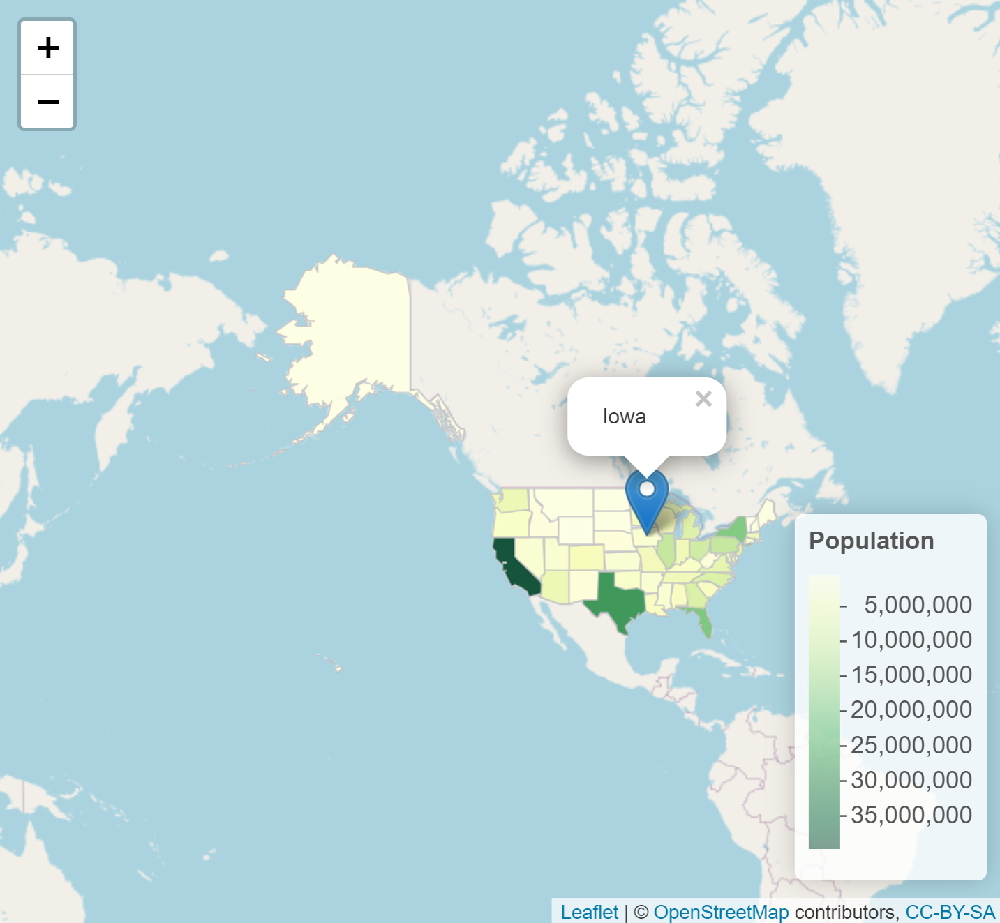

# Assignment 4

## Map 1: Create a Leaflet page in R that includes at least 20 markers.

## Map 2: Create icons

## Map 3: Add in a control to select from one of five basemaps

## Part 2 of this Assignment:
### Create a Leaflet page in R that includes a chloropleth. Import your shapefile and set the projection as demonstrated. Due two of the following 
## Map 4:

## Map 5:Add a Popup or a label 

## Map 6:Add a Legend 

## Map 7:Add an additional layers containing lines or markers. 

